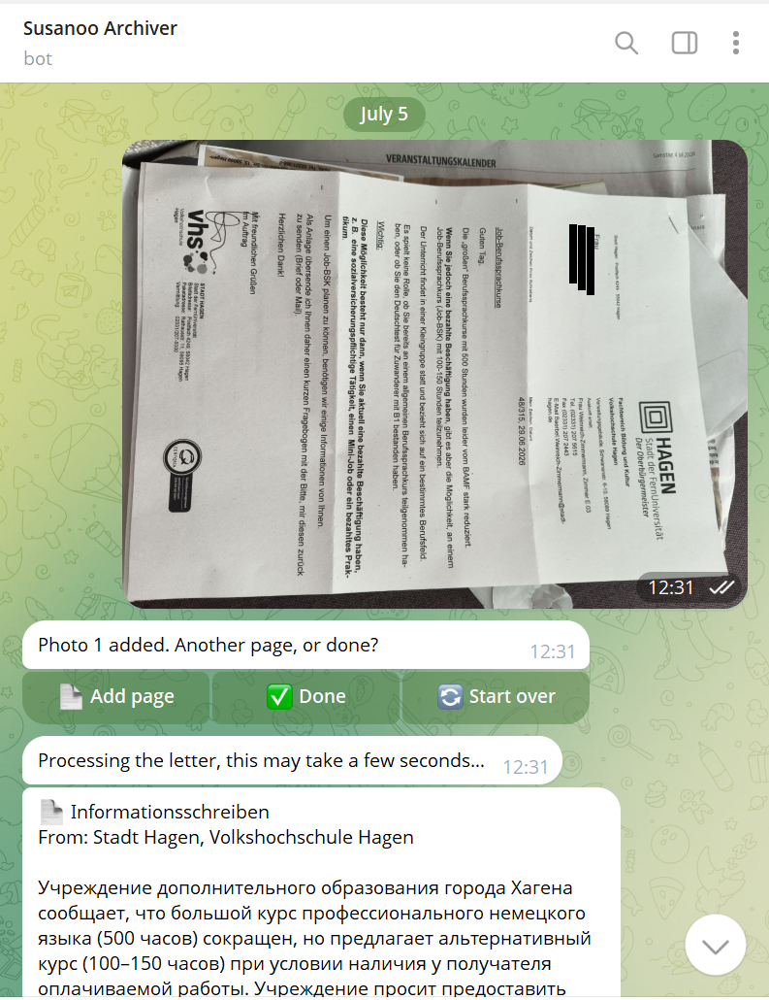
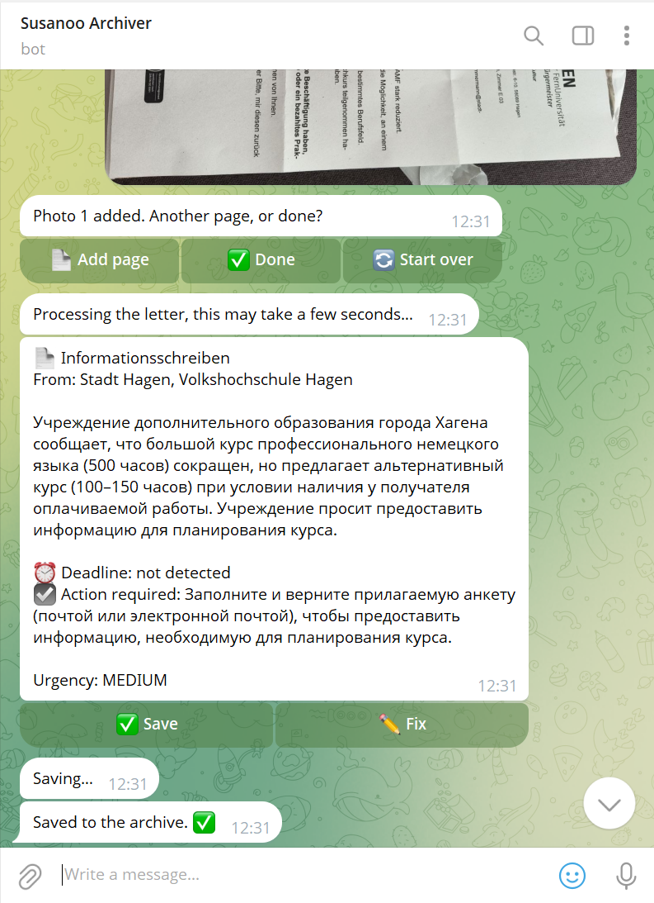

# Susanoo 🌩️

<p align="center">
  
</p>

<p align="center">
  
  
  
</p>

**A Telegram bot that archives German official letters — photograph it, and Susanoo figures out who sent it, what it means, and whether you need to act.**

Personal project born from a real problem: in Germany, official letters (tax office, health insurance, pension fund, etc.) must often be kept for up to 10 years, and deadlines buried in bureaucratic German are easy to miss. Susanoo turns a phone photo into a searchable, translated, deadline-aware archive entry — no manual filing required.

Also serves as a hands-on Platform Engineering / Cloud portfolio piece: serverless architecture, multi-language microservices, IaC, and CI/CD, all built and iterated on a real, low-traffic production workload.

---

## Demo

<p align="center">
  
  
</p>

---

## Architecture

```
Telegram ──▶ API Gateway ──▶ webhook_receiver (Go)
                                      │  SQS: updates
                                      ▼
                                  processor (Go)
                                      │
                    ┌─────────────────┴─────────────────┐
                    │ text / callback          photo    │
                    ▼                                    ▼
              handle inline                    download from Telegram
              buttons, session                  → save raw to S3
              state (DynamoDB)                  → append to session
                    │
                    │  «Done» pressed
                    ▼
            atomically transition session
            (guards against double-tap)
                    │  SQS: images-to-process
                    ▼
         tesseract-processor (Python, Container Image Lambda)
         Tesseract OSD → orientation correction → downsample (Pillow)
                    │  SQS: processed-images
                    ▼
                  processor (Go) resumes
                    │
        ┌───────────┼────────────────────┐
        ▼           ▼                    ▼
   assemble PDF   Claude Haiku vision   send preview
   (pdfcpu)       API classification    (Save / Fix)
                    │
              Save confirmed
                    ▼
         move PDF to {chat_id}/{org}/{year}/{month}/file.pdf
         write metadata to DynamoDB (with GSIs for querying)
```

Two independently deployed Lambda functions consume the **same** `processor` codebase's SQS queues via separate event source mappings — the heavy, slow-cold-starting image-preprocessing step is fully decoupled from the lightweight Telegram-facing logic, so a Tesseract container cold start never blocks the bot's responsiveness to button presses.

---

## Engineering decisions worth mentioning in an interview

**Serverless over Kubernetes, deliberately.** At "tens of letters per month," a full k8s/GitOps stack would be pure overhead. Explicitly documented as a non-goal from day one — an architecture decision, not a shortcut.

**Hybrid OCR + LLM, not one or the other.** Vision LLM (Claude Haiku 4.5) handles semantic understanding — classification, bilingual summarization, deadline extraction from natural-language German. Tesseract handles the narrow, mechanical task of orientation detection, which turned out to need a dedicated, purpose-built tool rather than a general-purpose model: an LLM-based rotation-retry approach was tried first and proved unreliable on messy real-world photos, motivating the move to a classical CV tool for that one sub-problem while keeping the LLM for everything semantic.

**Async pipeline to isolate cold-start cost.** Image preprocessing runs in a Container Image Lambda (Tesseract has native dependencies incompatible with Go's static-binary Lambda deployment). Rather than invoking it synchronously from the main bot Lambda, photos are batched once per letter and routed through SQS — the multi-second cold start of a Tesseract container is absorbed into a "Processing…" message the user already expects, not into every single photo upload.

**Idempotency via atomic DynamoDB conditional writes**, not application-level locking. Double-tapping "Save" or "Done" in Telegram is a real, observed failure mode; state transitions use `ConditionExpression` to guarantee exactly one code path proceeds, with the loser getting a clean "already handled" response instead of a race.

**Prompt engineering informed by real documents, not synthetic tests.** Multiple rounds of fixes driven by actual German letters: the model initially confused a *past* application date with a *future* deadline, treated boilerplate appeal-rights paragraphs (present in nearly every official `Bescheid`) as actionable tasks, and conflated a tax coverage period with a payment due date. Each fix is a targeted, documented rule in the prompt, not a blanket "be careful" instruction.

**Multi-tenant data isolation from day one.** S3 keys and DynamoDB items are scoped by `chat_id` at every layer — two users' letters can never collide or leak into each other's archive, verified by an explicit architecture review rather than assumed.

**No long-lived credentials in CI.** GitHub Actions assumes an IAM role via OIDC federation; the trust policy is scoped to this specific repository. Bootstrap infrastructure (the OIDC provider itself, Terraform state backend) is deliberately excluded from CI's own permissions — a role can't be used to grant itself more power.

---

## Tech stack

| Layer | Choice |
|---|---|
| Language (bot logic) | Go 1.24 |
| Language (image preprocessing) | Python 3.12 |
| Compute | AWS Lambda (arm64 for Go, x86_64 container image for Python) |
| Messaging | Amazon SQS (multi-stage pipeline, dead-letter queues) |
| Storage | Amazon S3, Amazon DynamoDB (with GSIs) |
| Secrets | AWS Secrets Manager |
| AI | Claude Haiku 4.5 (vision, prompt caching) |
| OCR / image | Tesseract OSD, Pillow |
| PDF | [pdfcpu](https://github.com/pdfcpu/pdfcpu) (pure Go) |
| IaC | Terraform |
| CI/CD | GitHub Actions (OIDC, no static AWS keys), separate pipelines for infra / Go / container image |
| Container registry | Amazon ECR |

---

## Features

- Multi-page photo capture via Telegram inline keyboard (`Add page` / `Done` / `Start over`)
- Automatic photo orientation correction (Tesseract OSD)
- AI classification: sender, document type, bilingual summary (EN/RU), extracted deadline, urgency, required action
- Human-in-the-loop confirmation (`Save` / `Fix`) before anything is archived — the model's output is a proposal, not an automatic action
- Organized archive: `{chat_id}/{organization}/{year}/{month}/{filename}.pdf`
- Queryable metadata (by user, by organization+date) via DynamoDB Global Secondary Indexes
- S3 lifecycle rules auto-expire transient working files (raw/processed photos), while final archived PDFs are kept indefinitely

---

## Project structure

```
cmd/
  webhook/      — thin Lambda: Telegram webhook → SQS (fast-ack only)
  processor/    — main bot logic (session state, LLM calls, archival)
internal/
  telegram/     — minimal Telegram Bot API client
  session/      — DynamoDB-backed session state machine (atomic transitions)
  storage/      — S3 wrapper (raw/processed/final document storage)
  letters/      — final archive metadata (DynamoDB)
  llm/          — Claude Haiku vision client + classification prompt
  pdfbuilder/    — multi-page PDF assembly
  imaging/      — (legacy, superseded by tesseract/ service)
  messages/     — all user-facing bot text, centralized
tesseract/      — Container Image Lambda: orientation correction + downsampling
infra/          — Terraform: all AWS resources
bootstrap/      — Terraform: OIDC provider, state backend (applied manually, once)
.github/workflows/ — Terraform plan/apply, Go build+deploy, Tesseract build+deploy
```

---

## Status

- ✅ Core pipeline: capture → preprocess → classify → confirm → archive
- ✅ Multi-service async architecture (Go + Python, SQS-orchestrated)
- ✅ Full CI/CD with IaC, OIDC auth, independent deploy pipelines per component
- ⏳ EventBridge-based deadline reminders
- ⏳ Cryptographic signing (AWS KMS) for archive integrity
- ⏳ OneDrive replication

---

## Running this yourself

This is a personal project wired to my own AWS account, Telegram bot, and Anthropic API key — not designed for one-click deployment by others. That said, the full infrastructure is defined in `infra/` (Terraform) and `bootstrap/`, and the deployment pipeline is entirely in `.github/workflows/` if you want to see how the pieces fit together.

---

## License

Personal project — no license file, all rights reserved. Shared publicly as a portfolio piece.